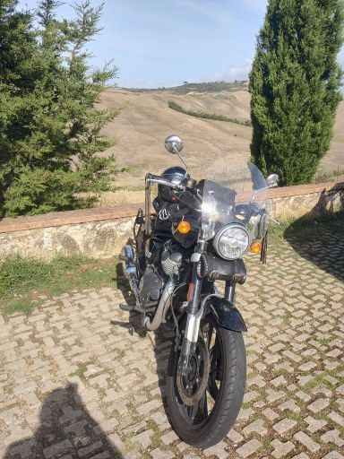
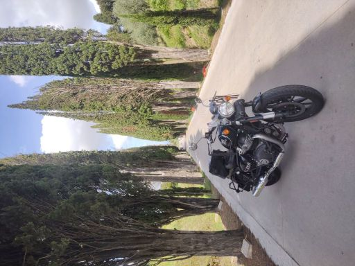
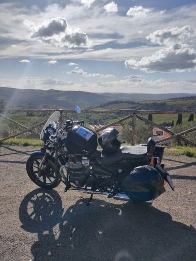

# 🏍️ Jessy And The Warrior

Ho partecipato a questo giro in Toscana organizzato da [Jessy And The Warrior Bike](https://ridersclubryu.my.canva.site/jessandthewarriorbike)
che voglio ringraziare per la **capacità organizzativa**. 
L'itinerario di 4 giorni in Toscana è la prova lampante di come una pianificazione attenta possa trasformare un bel giro in un'esperienza memorabile e su misura per un motociclista.

## 🛣️ Punti di Forza dell'Itinerario

### Giorno 1: Dalla Futa al Cuore del Chianti (Passo della Futa – Siena)
Un inizio dinamico: dal Passo della Futa (nonostante il tempo non fosse dei migliori),
passando per il Lago di Bilancino, Fiesole e Firenze (solo di passaggio), per poi immergersi totalmente nei panorami e nelle curve del Chianti.

### Giorno 1: Dalla Futa al Cuore del Chianti (Passo della Futa – Siena)

  

    
  

  

    ### Giorno 1: Dalla Futa al Cuore del Chianti (Passo della Futa – Siena)
    Un inizio dinamico: dal Passo della Futa (nonostante il tempo non fosse dei migliori), passando per il Lago di Bilancino, Fiesole e Firenze (solo di passaggio), per poi immergersi totalmente nei panorami e nelle curve del Chianti.
  

### 2. Giorno 2: L'Anello Panoramico (Crete Senesi – Bagni di San Filippo)
Il vero capolavoro del tour. L'anello delle **Crete Senesi** è stato un colpo di genio.

> **Nota Personale:** Per come sono io, questa è stata la tratta più bella.
> I panorami, le curve, la strada che serpeggiava sono stati momenti impagabili.

### 3. Giorno 3: Contrasti e Storia (Siena – Castelnuovo di Garfagnana)
Tappa ricca di contrasti: la "desertica" Colle Sant'Elsa, la caotica San Gimignano (per via del giorno di mercato), il fascino storico di Volterra e l'arrivo al leggendario Ponte del Diavolo (o della Maddalena).

### 4. Giorno 4: Il Rientro Forzato
Purtroppo, a causa di un malessere, il rientro verso Milano è stato da me anticipato e mi sono perso il giro sul tetto del mondo... sarà occasione per la prossima volta.
Un ringraziamento sentito va a **Ryu Lo Sheeba** per l'assistenza e il supporto fondamentale forniti durante il rientro forzato.

## In Sintesi

**Consiglio vivamente [Jessy And The Warrior Bike](https://ridersclubryu.my.canva.site/jessandthewarriorbike)** a chiunque cerchi un'organizzazione di viaggi in moto che costruisca un'esperienza completa, curata nel dettaglio e perfettamente bilanciata.
